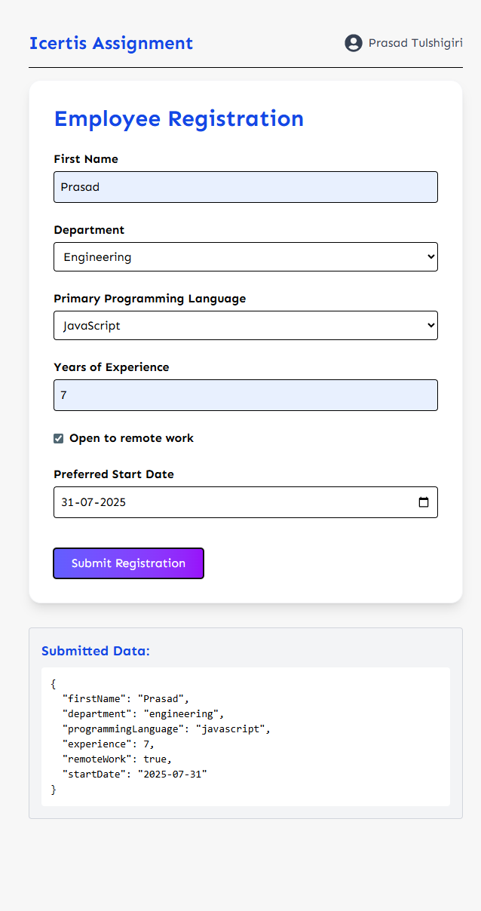

# Dynamic Form Assignment – Icertis

This project is a dynamic, schema-driven form built using **React**, **Redux Toolkit**, and **TypeScript**. The form is rendered based on a JSON schema fetched from an API, with built-in validation, conditional field rendering, and real-time feedback.

This is a low-code React app to dynamically generate forms from a JSON schema.

---

## 🚀 Features

- 🔄 Dynamic form rendering based on fetched schema
- ✅ Form field validation (required, pattern, length, min/max)
- 🧩 Conditional visibility based on dependencies
- 📦 Redux for global state management
- 🍞 Toast notifications for feedback
- 🧾 Submitted data displayed below the form
- 🎨 TailwindCSS styling

---

## 🛠️ Tech Stack

- React
- Redux Toolkit
- TypeScript
- Tailwind CSS
- React Toastify

---

## 📸 Screenshot


## 🧪 How to Run Locally

```bash
git clone https://github.com/prasad2394/icertis-form-assignment
cd icertis-form-assignment
npm install
npm run dev